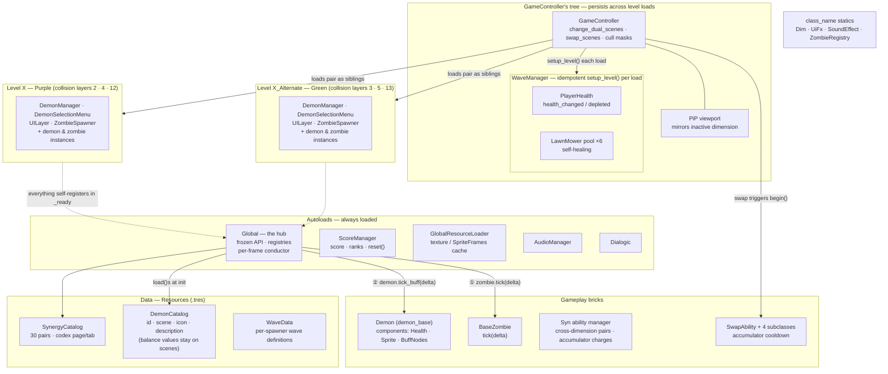

# README.md — Eye of Syn

2D pixel-art, lane/grid tower defense (PvZ-style) in **Godot 4.6 / GDScript**. Project id is
`PVZ0.1` (legacy — demons were once "plants"; the `Plants` group still exists). Core hooks: two
parallel **dimensions** the player swaps between, and a spatial **demon synergy/buff** system.

## Architecture

**`Global` autoload is the hub — and its API is FROZEN (2026-07 refactor rule).** It is the
service-locator + registry for nearly everything (demons, zombies, occulums, portals, syn/swap
abilities, lightning balls, shields, UI layers, demon managers, costs, synergies). Nodes **self-register**
in `_ready` and **deregister** on death/free. Existing call sites keep using `Global`
indefinitely — do not churn them. But **never add new registries, helpers, preloads, or state to
`Global`**: a new system gets its own module (`class_name` statics like `Dim`/`UiFx`/
`SoundEffect`/`ZombieRegistry`, a Resource catalog, or a node) and is referenced directly; files being
rewritten for other reasons migrate to direct module references opportunistically. Other
autoloads: `GlobalResourceLoader`, `AudioManager`, `Dialogic`, `ScoreManager` — do not add more.

**Dual dimension ("Purple" / "Green") is THE core mechanic.** Every level ships as a pair: `LevelX`
(Purple, default) + `LevelX_Alternate` (Green), loaded **simultaneously** as siblings under
GameController's `scene_container`. They are separated by **canvas visibility layers + viewport
cull mask** (`DIM_BITS`), not show/hide; shared UI is bit 0. `Global.is_on_purple_dimension()`
(== `game_controller.on_scene_1`) is the single source of truth. `swap_scenes()` flips the active
dimension, re-applies cull masks, makes the active `Camera2D` current, and updates the PiP (which
mirrors the *inactive* dimension). Persistent entities are **re-grouped + reparented** into the
active dimension on swap — anything meant to survive a swap must tolerate that.

**Dimension membership is a group, not a field.** Logic branches on `is_in_group("Purple")` /
`"Green"` (and many project-wide groups) far more than on type. Placing a demon auto-places an
invisible **`EmptyDemon` blocker** at the mirrored cell in the other dimension
(`place_empty_in_alt_scene`), so a demon in one dimension blocks its mirror cell in the other.

**Collision layers are a hard convention, assigned in CODE (not just scenes):** 2 = Purple demons ·
3 = Green demons · 4 = Purple zombies · 5 = Green zombies · 12 = Purple buff tiles · 13 = Green
buff tiles. Effect: **same-dimension nodes detect each other; cross-dimension never do, by design**
— this is how the two worlds stay physically isolated inside one scene tree. (`BloodTile` group
lives on the `TileArea` buff zones, not on the visual blood sprites.)

**Demons = `Area2D` + component composition + template-method base.** `Demon` (`demon_base.gd`) is
the base; concrete demons (Occulum, Crawler, Wyrm, Hive, Maw, SpinalOcculum, Heart) extend it and
`super()` into lifecycle hooks (`_ready`, `receive_buff`, `die`/`_cleanup`, `debuff`). Behavior
lives in child components (AnimatedSprite, Health, BuffNodes, PreviewNodes).

**Grid placement via a per-dimension `DemonManager`.** 32px grid; `grid_map: Dictionary` keyed by
**cell-center** (`floor(pos/32)*32 + 16`) → demon. Multi-cell demons write multiple keys (Maw = 2,
Heart = 6). Each dimension has its own DemonManager *and* DemonSelectionMenu.

**Buff/synergy is spatial + polled.** Each demon's BuffNodes component owns `TileArea` zones and
polls `get_overlapping_areas()` in `tick_buff(delta)` — driven by the conductor (below), gated by
`buff_ready` (set after the post-spawn awaits) and `can_process()`. Targets match by **exact
digit-stripped true name** (`get_demon_true_name()`) against the demon's exported `give_buff_to`
list — substring matching is gone. Synergy pair identity + codex navigation live in
`SynergyCatalog.tres` (30 `SynergyDefinition`s); unlock STATE is `Global.unlocked_synergies`
(session-only). Synergy ids capitalize only each word's first letter (`"SpinalocculumOcculum"`) so
pairs split on capitals — build them with `SynergyDefinition.make_id()`, never by hand. The
placement preview uses **oldest-overlapping-zone-wins** and hides a zone whose cell is occupied. A
demon scene is previewable only if it contains a node named exactly **`PreviewNodes`** (its
children are duplicated semi-transparent and dragged with the cursor).

**`Global._process` is the per-frame conductor.** Explicit order, one pause gate:
**(1)** every zombie's `tick(delta)`, then **(2)** every demon's `tick_buff(delta)` (BuffNodes
polling) — buffs always react to settled positions. Both loops iterate a *duplicate* of the
registry array with validity guards. Zombies and BuffNodes have no per-frame callbacks of their
own — new per-frame gameplay logic belongs in `tick`/`tick_buff`, added to the conductor in an
explicit position. Syn charges and the swap cooldown keep their own accumulator `_process`; they
touch no cross-system state mid-frame. Zombie types differ by their components/abilities, not
base tick.

**Waves: data resources sequenced by the persistent `WaveManager`.** Per-dimension
`ZombieSpawner`s hold `Array[WaveData]` (`.tres`). `WaveManager` lives under GameController's
`CurrentScene` and **survives level loads** — `change_dual_scenes` re-runs its **idempotent
`setup_level()`** on every load/restart (never invoke `_ready` manually). Player health is its
`PlayerHealth` child node (`max_health` set in WaveManager.tscn; emits
`health_changed`/`depleted`, UILayers subscribe). Lawnmowers are a **self-healing pool**
(`LawnMower.tscn`): `_ensure_lawn_mowers()` re-finds or recreates all six each level, and each
mower stamps itself to its dimension's visibility layer. The spawn pool is **shuffled per wave**
(order is random). Wave previews register with the manager.

**Syn abilities (player-activated) are cross-dimension pairs.** Each cast spawns a Purple + Green
half that self-register; when both are present `Global` **links** them (`connect_syn_abilities` /
`connect_lightning_balls` / `connect_syn_shields`) and draws a cross-dimension connector. Cooldown
is a per-charge **accumulator state machine** (READY/ACTIVE/COOLDOWN) advanced in `_process` by
`delta * rate` — **not** a Timer restart. Two charges (one per dimension) share one UI bar; a charge
recharges **4× faster while the other dimension's charge is deployed**; cooldown **starts when the
deployed instance dies, not at cast**.

**Swap abilities are triggered by the swap itself.** Not player-cast: `GameController.swap_scenes()`
→ `Global.start_swap_ability()` → `swap_ability.begin()`. Named abilities (blood rain, lucretia
grasp, lightning storm, gaze of baal) extend `SwapAbility` and override `apply_swap_ability` /
`undo_swap_ability` / `get_icon`. `begin()` runs **before** `on_scene_1` flips, so an ability must
read `is_on_purple_dimension()` at apply time, not cache the dimension. Cooldown/duration are
**accumulator-driven** like syn (`is_active`/`is_on_cooldown` + counters in `_physics_process`,
no Timer nodes): early cancel → normal cooldown, full duration → −2.5 s special cooldown.

**Content catalogs are Resources; balance numbers are scene exports.** `DemonCatalog.tres` holds
each placeable demon's identity (id = true name, scene, icon, description path);
`SynergyCatalog.tres` holds the 30 synergy pairs + codex navigation. Adding a demon or synergy is
**data-only** — zero `Global` edits. Costs/HP/timers deliberately **stay on the demon scenes**;
`get_demon_cost()` derives the menu label from the definition's scene lazily, so the label and
the amount charged can never drift.

**Scoring + style rank.** Each demon accrues `game_time` and reports to `ScoreManager` on the
`level_ended` signal (weighted by whether it was buffed). Per-level threshold arrays (exported on
the level script) map the total to a **style rank**, shown on the end-of-level score screen —
**purple dimension only**.

**`GlobalResourceLoader`** preloads/caches demon & zombie textures + `SpriteFrames` (and per-synergy
variation images) at startup to avoid runtime load stalls — a separate concern from `Global`'s game
state.

**Rendering is pixel-perfect 2D.** Fixed small base viewport (~740×412) + `canvas_items` stretch +
nearest-neighbor filter + `snap_2d_transforms_to_pixel` + `hdr_2d`. Author art/UI against the fixed
base resolution and keep it integer-aligned; `Engine.max_fps` is pinned to the monitor refresh rate.
Mouse reaches shaders via the **global** shader uniform `mouse_screen_pos`, pushed every frame with
`RenderingServer.global_shader_parameter_set(...)` — reuse this channel, don't add per-material mouse
uniforms.

## Gotchas

- **Registration arrays never deregister on death.** Always iterate with `is_instance_valid()`
  guards. To compact one, build a **new** array and filter — never alias an Array and append while
  iterating (reference type → infinite-loop hard-freeze on restart; already hit once).
  `Global.compact_registrations()` / `resetOcculumCount` are the correct templates.
- **`ScoreManager.reset()` is called from `level_template._ready`** (alongside
  `Global.reset_all_variables()`). Any new level-entry path that bypasses `level_template` must
  call both, or scores/registries leak across runs.
- **`add_child(scene)` runs the whole subtree's `_ready` synchronously on the main thread.** Each
  dimension instantiates a full DemonSelectionMenu + grids, so a blocking/looping child `_ready`
  freezes the game mid-transition. Restart re-enters `change_dual_scenes` — the hot path for
  restart bugs.
- **Manual `_ready()` re-invocation still exists in `GridManager`** (`tilemapLayer._ready()`) →
  double-init risk. WaveManager's was replaced by public `setup_level()` — keep it idempotent;
  `@onready` initializers do NOT re-run on re-invoked `_ready`.
- **Overlap/area queries are invalid for the first few physics frames after spawn.** Existing code
  awaits 2–4 `physics_frame`s before `get_overlapping_areas()` (demon spawn 2, syn instance ~3,
  shield 4) — preserve these awaits.
- **Group membership must be set BEFORE the node enters the tree.** `place_demon` adds the
  Purple/Green group *then* `call_deferred("add_child")`; `_ready` reads the group to pick collision
  layers. Reordering silently breaks dimension isolation.
- **Demon names carry numeric suffixes** (`generate_unique_name` → `Occulum3`); identity checks
  use digit-stripped `get_demon_true_name()`. Buff matching is **exact-name** now — do not
  reintroduce substring `in`-matching on node names (the old `"Occulum"` ⊂ `"SpinalOcculum"`
  trap). The **`Occulum` spelling is intentional and load-bearing**; synergy IDS additionally
  lowercase inner capitals (`"Spinalocculum"`) — build ids with `SynergyDefinition.make_id()`.
- **Never `preload()` a resource that references demon scenes from an autoload** — it's a
  compile-time cycle (demon scripts `extend Demon` and can't compile while `Global` is
  mid-compile: "Could not resolve class Demon"). Use `load()` (see `demon_catalog`).
- **Two temporary diagnostics are armed** (delete after one clean full playtest):
  `[BUFF-MIGRATION]` (BuffNodes dual-runs old substring vs new exact matching and warns on
  disagreement) and `[MOWER]` `_exit_tree` warnings (something external frees launched mowers —
  culprit unidentified; warnings at app quit are normal teardown, mid-session ones are the catch).
- **`EmptyDemon` (`is_empty`) short-circuits `_ready`** — no processing/registration; it exists only
  as a cross-dimension placement blocker.
- **Maw uses a deliberate `-256` visual offset** in `place_demon` while its `grid_map` keys stay on
  the clean grid — not a bug.
- **`@tool` scripts run in the editor** (e.g. `tile_map_layer.gd`); guard any `Global.*` access with
  `Engine.is_editor_hint()` (`Global.game_controller` is null in-editor).
- **`use_parent_material = true` silently disables a node's own shader** (no error, no effect).
- **The 3D card shader is authored for Sprite2D (centered-origin) space.** On a Control/TextureRect
  (top-left origin) the naive math discards every pixel; the in-repo version uses a `rect_size`
  uniform — keep that path for Control hosts.
- **A linked Syn pair's cross-dimension connector is not torn down on the survivor when one half
  dies.**
- **Export-only crashes are almost always case-sensitive `res://` path mismatches** (editor on
  Windows hides them; export breaks). Debug with `console.exe --verbose` — the in-game log file
  truncates.
- **Run the game fullscreen.** Windowed mode causes DWM compositor present-stalls — false frame dips
  below ~90 fps that are not game bugs.
- **Perf ceiling ≈ 144 tentacles** (`curved_lines_2d` addon). LOD isn't viable; staggering deferred;
  GDExtension/compute under evaluation. Treat tentacle count as the perf-critical constraint.

## Regression checklist (reference level: Level0-2)

Run the relevant items after any change near the touched system; run the FULL list after
refactor phases that touch the restart path, buff matching, or tick order.

1. **Place:** each demon type in both dimensions; costs correct; Occulum +15/+25 cost scaling
   per dimension; mirror-cell blocker prevents placement in the other dimension.
2. **Buffs:** each demon gives + receives a buff; SpinalOcculum does NOT trigger Occulum-only
   entries (and vice versa); debuff on buffer death.
3. **Swap:** ability fires `begin()` *before* the dimension flip; bar fills; early-cancel =
   normal cooldown, full duration = −2.5 s; lock toggle; PiP mirrors the inactive dimension.
4. **Syn:** cast in both dimensions → pair links + connector drawn; 4× recharge while the other
   half is deployed; cooldown starts at instance death.
5. **Waves/health:** leak a zombie → ONE mower launch; health decrements in both dimension
   labels; lose at 0; early-wave call adds blood + score.
6. **Score:** completion-time rank varies with the level's exported thresholds; style points;
   synergy multiplier growth.
7. **Restart torture:** restart ×3 from purple pause, ×3 from green, once mid-wave with a
   deployed syn instance + active swap ability + launched mower — no freeze, no error spam,
   score 0, health full, mowers restored, costs reset, no stale connectors.
8. **Progression:** advance to the next level normally; level-unlock flags intact.

## Important File Paths 
- ** res://_Utilities/global.gd **
- ** res://_Utilities/dim.gd ** (dimension groups + collision-layer constants)
- ** res://_UI/ui_fx.gd ** (pulsing-highlight statics)
- ** res://_Utilities/GameController/game_controller.gd **
- ** res://_Utilities/Waves/WaveManager.gd **
- ** res://_Utilities/Waves/PlayerHealth.gd **
- ** res://_Utilities/Zombies/ZombieSpawner.gd **
- ** res://_Entities/Demons/demon_base.gd **
- ** res://_Entities/Demons/BloodBuff/BuffNodes.gd **
- ** res://_Entities/Demons/Definitions/DemonCatalog.tres **
- ** res://_Entities/Demons/Synergies/SynergyCatalog.tres **
- ** res://_Entities/Zombies/BaseZombie.gd **
- ** res://_Utilities/Demons/DemonManager.gd **
- ** res://_Utilities/Demons/DemonSelectionMenu.gd **
- ** res://_Stages/level_template.gd **
- ** res://_Entities/SynAbility/syn_ability.gd **
- ** res://_Entities/SwapAbilities/swap_ability.gd **
- ** REFACTOR_PLAN.md ** (living refactor status, per-phase validation)
